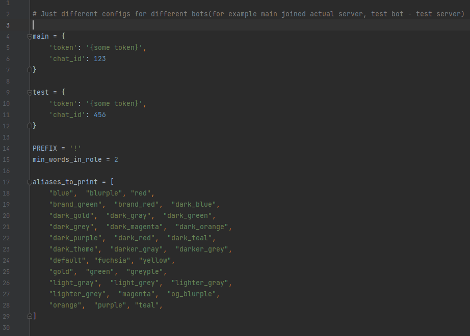

# Kekos' Bot Commands

---

`!color {hex/alias}` will change your first unique
role(role that only you own)'s with more than {min_words} words in its name color

Can be used with either #{hex} and {hex}

---

`!color_aliases` will print all possible aliases

### Config

---

#### Config should look like that:

